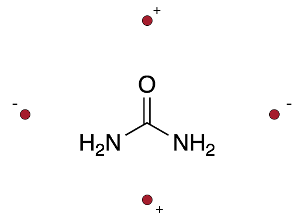
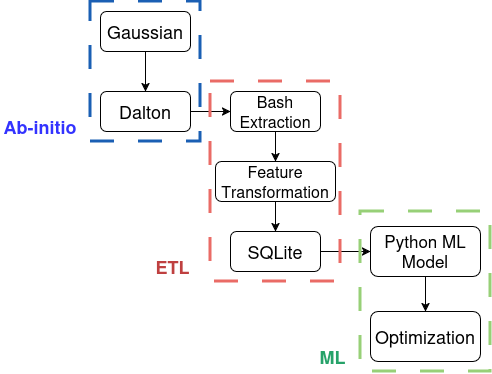
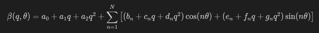
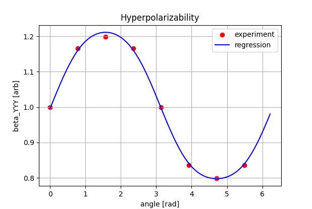

# Machine Learning Surrogate Model for Nonlinear Optical Response

This project develops a machine learning surrogate model to approximate computationally expensive quantum-chemistry simulations of molecular hyperpolarizability.

The objective is to learn the relationship between external electric field configurations and the nonlinear optical response of a molecule. Instead of applying a direct electric field in the simulation, the field is generated by placing point charges around the molecule, which produces a controlled electrostatic environment.

The urea molecule (figure 1) is used as a case study, but the workflow and modeling approach can be applied to other molecules and properties where quantum simulations are computationally expensive.

  
   
  <em>Fig. 1: Urea molecule and quadrupolar charge configuration around.</em>

## Problem Motivation

Quantum-chemistry calculations of nonlinear optical properties are computationally costly. Exploring many electric-field configurations requires running a large number of simulations.

A surrogate machine learning model allows us to:

- approximate the simulation results
- interpolate between simulated configurations
- identify optimal configurations that maximize the nonlinear optical response

This approach enables fast exploration of parameter spaces that would otherwise require many expensive simulations.

## Simulation Pipeline

  
   
  <em>Fig. 0: Simulation pipeline diagram.</em>

### 1. Molecular Geometry Optimization

The molecular geometry of urea was first optimized using Gaussian, producing the equilibrium structure used in the subsequent calculations.

### 2. Quantum-Chemistry Simulations

Nonlinear optical properties were computed using the Dalton quantum-chemistry package.

The nonlinear optical response considered here is the hyperpolarizability component:

$\beta_{YYY}$

Different electrostatic environments were generated by placing point charges around the molecule, producing external electric fields with different strengths and symmetries.

### 3. Data Extraction

Simulation outputs were parsed using Bash scripts, extracting:

- charge magnitude
- angular orientation
- hyperpolarizability values

### 4. Feature Transformation

Angular variables were transformed using trigonometric features:

$\cos(\theta)$, $\sin(\theta)$

This transformation respects the periodic nature of the angular variable.

The hyperpolarizability values were also normalized relative to a reference gas-phase value.

### 5. Dataset Storage

The processed dataset was loaded into an SQLite database using Bash scripts.

This database serves as the input for the machine learning pipeline.

## Machine Learning Model

The surrogate model is implemented in Python using a modular architecture.

Main components:

- main.py – workflow orchestrator
- regression.py – regression model implementation
- db.py – database access
- rescale.py – feature scaling
- plot.py – visualization

The model uses:

- polynomial regression
- feature scaling
- Ridge regularization

Ridge regularization improves numerical stability and reduces sensitivity to correlated features.

## Feature Engineering

Initial experiments used polynomial features based on:

$q$, $\cos(\theta)$, $\sin(\theta)$

However, this representation introduces dependencies such as:

$\cos(\theta)^2 + \sin(\theta)^2 = 1$

which can produce unstable regression behavior.

To address this, the final model uses a harmonic expansion of the angular variable:

This Fourier-like representation:

- respects angular periodicity
- removes feature redundancy
- improves regression stability

## Symmetry Considerations

Different charge configurations correspond to different symmetries of the electrostatic field.

Because these configurations represent fundamentally different physical situations, they cannot be fitted well by a single continuous model.

Therefore, separate surrogate models were trained for each configuration type.

## Example Fits

The surrogate model accurately reproduces the angular dependence of the hyperpolarizability for most configurations.

Example regression results are shown in figure 2. More results in __results__ folder.

  
   
  <em>Fig. 2: Hyperpolarizability from Dalton calculations  (red dots) and Python fit (blue) as a function of the angle that forms the charge distribution with the molecule. The figure corresponds to a dipole charge configuration and charge value $q=0.05$ [units of electron charge].</em>

In most cases the agreement is excellent.

However, in some configurations the fit quality is lower, indicating that the harmonic expansion likely needs to include higher-order harmonics.

This diagnostic behavior is useful because it provides insight into the structure of the response function.

## Optimization

Once the surrogate model is trained, it can be used to search for configurations that maximize the nonlinear optical response.

The model predicts the hyperpolarizability as a function of:

- charge magnitude
- angular orientation
- charge configuration type

This enables efficient identification of the charge configuration that maximizes the nonlinear optical response.

## Technologies Used

- Python
- NumPy
- scikit-learn
- SQLite
- Bash
- Gaussian
- Dalton

## Project Structure

project/\
│\
├── main.py\
├── regression.py\
├── db.py\
├── rescale.py\
├── plot.py\
├── utils.py\
│\
├── data/\
│   └── sqlite database\
│\
└── figures/\
└── bash/\
└── results/

## Potential Extensions

Possible future improvements include:

- inclusion of higher-order harmonics
- neural network surrogate models
- extension to other molecules and nonlinear optical properties
- automated exploration of optimal charge configurations